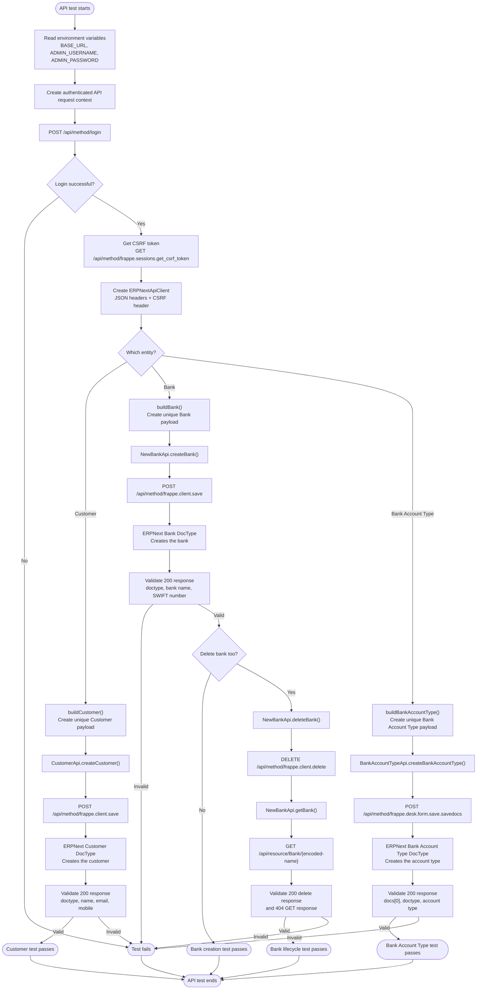

# ERPNext API Entity Creation Flow

This chart shows the shared API setup and the Customer and Bank entity flows
implemented in the Playwright test framework.



## Payload shape

Customer and Bank create operations use the following ERPNext document wrapper:

```json
{
  "doc": {
    "doctype": "Customer or Bank",
    "field_name": "value"
  }
}
```

Bank Account Type additionally sends the `action: "Save"` property and uses
the `frappe.desk.form.save.savedocs` endpoint.

## Main components

| Flow stage | Implementation |
| --- | --- |
| Authentication | `fixtures/api.ts` |
| CSRF token retrieval | `api/utils/csrfToken.ts` |
| Shared HTTP transport | `api/client/erpnextApiClient.ts` |
| Customer creation | `api/client/customerApi.ts` |
| Bank creation and deletion | `api/client/newBankApi.ts` |
| Bank Account Type creation | `api/client/bankAccountTypeApi.ts` |
| Customer payload builder | `api/builders/customerBuilder.ts` |
| Bank payload builder | `api/builders/bankBuilder.ts` |
| Customer test | `tests/api/Customer/createCustomer.spec.ts` |
| Bank create test | `tests/api/payments/bank/createABank.spec.ts` |
| Bank delete test | `tests/api/payments/bank/deleteABank.spec.ts` |
| Bank Account Type test | `tests/api/payments/bank/BankAccountType/createBankAccountType.spec.ts` |
