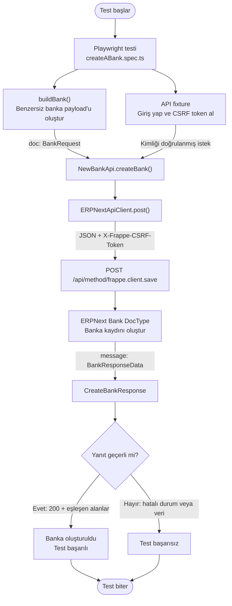

# Yeni Banka API Flow Chart



## Request payload

```json
{
  "doc": {
    "doctype": "Bank",
    "bank_name": "Automation Bank 1234567890",
    "swift_number": "AUTOCA67890"
  }
}
```

## Main files

| Layer | File | Responsibility |
| --- | --- | --- |
| Test | `tests/api/payments/bank/createABank.spec.ts` | Sends the request and verifies the response |
| Builder | `api/builders/bankBuilder.ts` | Creates a unique bank payload |
| Model | `api/models/bankRequest.ts` | Defines the request contract |
| API service | `api/client/newBankApi.ts` | Defines the ERPNext endpoint |
| HTTP client | `api/client/erpnextApiClient.ts` | Sends the authenticated POST request |
| Fixture | `fixtures/api.ts` | Provides login, CSRF token, and `bankApi` |
